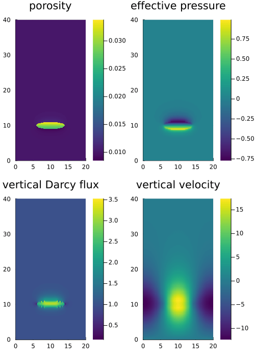

# Benchmarks

Followingly are some selected benchmark runs performed using the hydro-mechanical solver.

## Porosity wave benchmark

Using the decompaction weakening approach as in [Raess et al.](https://academic.oup.com/gji/article/218/3/1591/5497299?login=true). We set up the benchmark for the porosity wave regime as limit of two-phase flow. The goal of this benchmark is to verify the reproducibility of the methodology as described [here](methodology.md)


[  ] DI versus PT (2D)

[  ] numerical vs. exact analytical solutions of solitary waves (1D)

[  ] convergence study with varying spatial and temporal resolutions (2D)


### Results

#### Incompressible

*Resulting animation of the code provided in the [`HydroMech2D.jl`](https://github.com/omlins/ParallelStencil.jl/blob/main/miniapps/HydroMech2D.jl), which is the starting point of our implementation of the solver.*

`R=500`, `t=0.02`


`R=1.0`, `t=0.2`




#### Compressible

*Followingly are the (truncated) results using the same model setup but with additional physical variables added for the compressible terms of the mass conservation equation*

`R=1000`


`R=500`


`R=1.0`, `t=0.03`


```julia
# dimensionalized parameters used in (Dal Zilio et al. 2022)
µ = 25G*Pa            # shear modulus
Ks = 50G*Pa           # bulk modulus
βs = 2.5 10^-11 1/Pa  # solid compressibility
βf = 4.0 10^-10 1/Pa  # fluid compressibility
```


## Fluid injection 2D benchmark


Reproduce fluid injection 2D benchmark in [Luca et al. 2022](https://www.sciencedirect.com/science/article/pii/S0040195122003109)