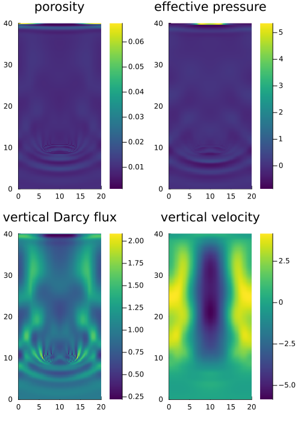

# Troubleshooting

## No solutions after certain iteration count

**Status**

[ ] Resolved 

Using the 2D Hydro-mechanical solver for small R values, solution cannot be correctly plotted after a certain state has been reached. The solution can be correctly plotted until the 48th frame (included) as followed.


**Description**

`R=0.5`, `t=0.2`


Where at the 48th frame the distribution of the parameters looks as followed




```bash
it = 1138, time = 3.307e-02 sec (@ T_eff = 24.00 GB/s) 
it = 1139, time = 3.316e-02 sec (@ T_eff = 24.00 GB/s) 
it = 1140, time = 3.313e-02 sec (@ T_eff = 24.00 GB/s) 
GKS: Rectangle definition is invalid in routine SET_WINDOW
GKS: Rectangle definition is invalid in routine CELLARRAY
invalid range
GKS: Rectangle definition is invalid in routine SET_WINDOW
GKS: Rectangle definition is invalid in routine CELLARRAY
```

Then at the frames after the 48th frame it looks identical to the 49th frame.


## Overhead brought by using MetaHydroMech.jl

**Status**

[x] Resolved 
     - by calling only one `compute!()` kernel
     - use the `const` to fix the type instability problem of PTArray


**Description**

Using the same pattern as `JustRelax.jl`, we added the `MetaHydroMech.jl` to predefine the environment needed for the use of the `ParallelStencil.jl`. However this brought us a significant loss in the performance. Before it was around 24 GB/s after the code improvement.

```bash
it = 1, time = 1.653e+00 sec (@ T_eff = 9.00 GB/s) 
it = 2, time = 1.519e-01 sec (@ T_eff = 16.00 GB/s) 
it = 3, time = 3.360e-01 sec (@ T_eff = 12.00 GB/s) 
it = 4, time = 2.038e-01 sec (@ T_eff = 16.00 GB/s) 
it = 5, time = 2.077e-01 sec (@ T_eff = 16.00 GB/s) 
it = 6, time = 2.661e-01 sec (@ T_eff = 15.00 GB/s) 
it = 7, time = 2.399e-01 sec (@ T_eff = 14.00 GB/s) 
it = 8, time = 2.561e-01 sec (@ T_eff = 16.00 GB/s) 
it = 9, time = 2.614e-01 sec (@ T_eff = 16.00 GB/s) 
it = 10, time = 2.914e-01 sec (@ T_eff = 14.00 GB/s) 
it = 11, time = 2.558e-01 sec (@ T_eff = 16.00 GB/s) 
it = 12, time = 2.582e-01 sec (@ T_eff = 16.00 GB/s) 
it = 13, time = 2.649e-01 sec (@ T_eff = 15.00 GB/s) 
it = 14, time = 2.845e-01 sec (@ T_eff = 14.00 GB/s) 
it = 15, time = 2.564e-01 sec (@ T_eff = 16.00 GB/s) 
Test Summary:                              | Pass  Total
Reference test: HydroMech2D_incompressible |    5      5
     Testing HydroMech tests passed 

```